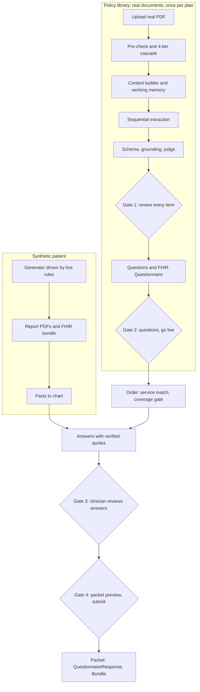

# ClearPath PA Engine Constitution (v4)

Owner: Suman (prior authorization part)
Project: ClearPath Health, HackGT 13, Georgia Tech, September 2026
Status: authoritative. Replaces every earlier version.

This folder is the single source of truth for the PA engine. If code disagrees with these files, the code is wrong. Put it at `docs/pa-constitution/` and add to `.cursor/rules` or `CLAUDE.md`:

> Follow every rule in `docs/pa-constitution/`. Read `memory.md` before changing extraction, prompts, thresholds, or models. If a request conflicts with a rule, stop and name the rule.

## 1. What this part does

Takes **real, publicly published insurance documents** from **any insurer**, turns their prior authorization rules into validated, cited, human-approved questions, answers those questions from a **synthetic patient's reports** with quoted evidence, and lets a clinician review every answer, sign off, and submit. Every output is also emitted as FHIR.

**LLM extracts. An independent LLM judges. A human decides.** At every gate.

## 2. The whole flow

## 3. Principles carried from Suman's earlier benefit-plan work

Rebuilt from scratch for this public repo. No code, prompts, schemas, or documents are reused.

| Earlier principle | Kept as | Changed because this project has no such constraint |
|---|---|---|
| No automatic denial | G1 | none |
| LLM extracts, second LLM judges, human decides | Four human gates (`11`) | none |
| Judge verdicts ACCURATE, WRONG_VALUE, HALLUCINATED, VAGUE; routes to auto_approved or pending_review | Same (`11`) | none |
| Never overwrite a human edit, enforced in storage | H1, enforced in `repository.py` | none |
| Stateless, no database | **Dropped** | Three teammates and live updates need Supabase |
| No insurer or plan hardcoding | R1, R2 | none |
| Pre-check as hint, 4-tier cascade | `05` | Extended to three document roles |
| Context builder, sequential extraction with working memory | `06` | Adds plan-level memory across documents |
| Episodic log, resume from last completed page group | `episodes` table; resume reads it (`18`) | Stored in DB; also powers timelines and audit |
| Fingerprint cache keyed by content, checked globally first, atomic writes | Artifact, model-call, FHIR, answer caches (`18`) | Versioned keys replace the unbuilt v1/v2 folders |
| Plain httpx, no SDKs, no LangChain or LangGraph | Same | none |
| Per-tier timeouts, per-record failure degradation | F1, `06` | none |
| FHIR `Questionnaire`, `InsurancePlan`, `QuestionnaireResponse`, 100% validation, markdown audit | `09` | Adds Bundle and PAS-shaped Claim as stretch |
| Synthetic PDF and answer-key generator | Synthetic patient generator (`15`) | Generates patient reports, not policies |
| Regression gate: one fuzzy method, Jaccard at 0.4 | `13` | none |
| Targets: 98% decision fields, 95% descriptive, 100% FHIR valid, full traceability | `13` | none |
| Append-only memory log with real numbers | `memory.md` | none |
| Test against real documents before done | `16` | none |

What is new here and did not exist before: reading a patient chart, evidence matching with verified quotes, clinician answer review, readiness, submission, drug criteria blocks, plan memory, synthetic patients generated from live rules.

## 4. Real documents, synthetic patients

| Input | Source | Rule |
|---|---|---|
| Insurance rules | Real public documents: benefit summary or EOC, clinical policy, drug PA criteria (`14`) | Never invented. A fictional policy only as a labeled fallback. |
| Patient reports | Synthetic, generated from the live rules (`15`) | Never real people. Every page marked synthetic. |

The rules drive the patient data, never the reverse.

## 5. Files

| File | Covers |
|---|---|
| `01-GUARDRAILS.md` | Non-negotiable rules |
| `02-ARCHITECTURE.md` | System, components, sequences, folders, stack, env, deploy |
| `03-DATA-MODEL.md` | Every table, state machine, lock, and shape |
| `04-API.md` | Endpoints, JSON, errors, teammate contracts |
| `05-INGESTION.md` | Pre-check, 4-tier cascade, three document routes, extraction to draft |
| `06-ORCHESTRATION-MEMORY-CONTEXT.md` | Ordered pipeline runner, working memory, context builder |
| `07-CHECK-ENGINE.md` | Order matching, coverage gate, answering, evaluation, re-check, submit, insurer |
| `08-QUESTIONNAIRE.md` | Question design, templates, pass condition language |
| `09-FHIR-ENGINE.md` | FHIR resources, mappings, validation, versions, audit |
| `10-PROMPTS.md` | Every prompt and schema |
| `11-HUMAN-IN-THE-LOOP.md` | Gates, review states, locks, audit |
| `12-UI.md` | Every screen and component |
| `13-VALIDATION-AND-ACCURACY.md` | Validation layers, gold sets, metrics, eval |
| `14-DOCUMENT-SOURCES.md` | Which real documents, where, how to store them |
| `15-SYNTHETIC-PATIENTS.md` | Generating patient reports from live rules |
| `16-QUALITY-AND-DELIVERY.md` | Tests, e2e, scope tiers, timeline, demo script, done |
| `17-GAPS-RISKS-DECISIONS.md` | What was missing, risks, and decisions |
| `18-EPISODIC-MEMORY-AND-CACHE.md` | Append-only episode timeline, resume, fingerprint cache layers |
| `memory.md` | Append-only decision log |

## 6. Glossary

| Term | Meaning |
|---|---|
| Benefit summary / EOC | Plan document saying which services need prior authorization |
| Clinical policy | Criteria for one service, from the insurer or its delegated vendor |
| Drug criteria | Per-drug PA criteria, organized in blocks |
| Item | One extracted coverage entry or rule, with page and review state |
| Condition | One atomic fact inside a rule |
| Question | A typed question asking for one fact |
| Answer | A fact filled from the chart or by a clinician, with evidence |
| Pass condition | Code-evaluated logic over answers deciding if a rule is met |
| Readiness | Met rules / total rules |
| Packet | What is sent to the insurer: answers, evidence, attestations, FHIR |
| Gate | A point where a named human must decide |

## 7. Ownership

This part owns: document ingestion, policy library, review workflows, question building, FHIR engine, fact extraction from reports, answering, evaluation, checklist screen, packet, fake insurer, audit, eval, and the scenario spec for synthetic patients. Tables: `policies`, `policy_blocks`, `policy_items`, `plan_memory`, `ingestion_runs`, `episodes`, `artifact_cache`, `llm_calls`, `pa_requests`, `pa_criteria`, `pa_answers`, `pa_events`, `review_log`.

Not owned: app shell, upload screen, dashboards, patient view, patient seeding (Sambhav); huddle, Muse, WhatsApp (Harry). Contracts in `04`.
