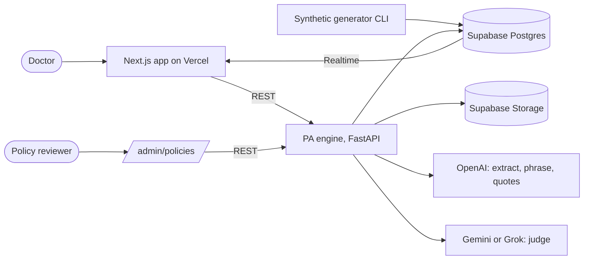
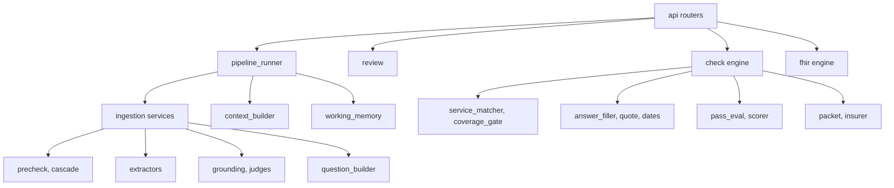
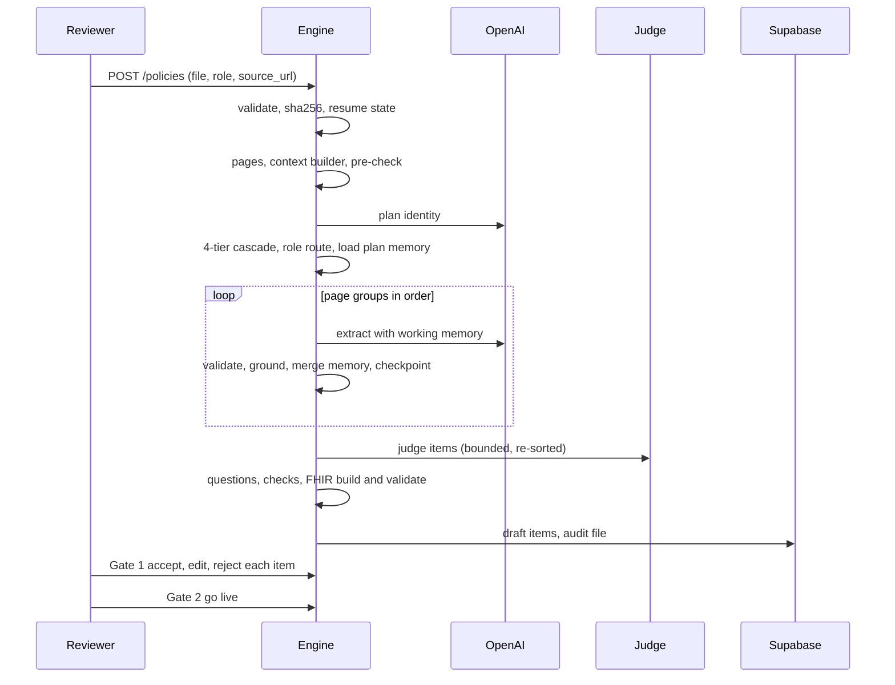
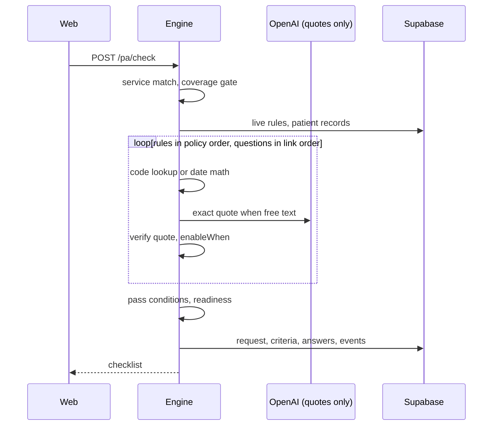

# 02. Architecture

## System context



## Components



## Layer rules

1. Routers hold no logic.
2. Only `repository.py` touches Supabase, and it enforces the human edit lock (H1).
3. Only `llm.py` touches model APIs (plain httpx, JSON repair retry, think-tag stripping, timeouts per call type).
4. Only `pipeline_runner.py` sequences model calls (F4).
5. Every model input is built by `context_builder.py` (F6).
6. Only `review.py` sets review states (G5).
7. Only `pass_eval.py` decides met or missing (G6).
8. Only `fhir/` builds FHIR resources, and everything it emits is validated before it is stored or returned.
9. Only `pipeline/episodes.py` writes episodes; every stage, call, and human action goes through it.
10. Only `pipeline/cache.py` reads and writes `artifact_cache`; every model call goes through the model-call cache in `llm.py`.

## Sequence: ingestion



## Sequence: order check



## Folder layout

```
pa-engine/
  app/
    main.py  config.py  llm.py  repository.py
    api/           health.py policies.py review.py reports.py pa.py fhir.py
    pipeline/      pipeline_runner.py context_builder.py working_memory.py episodes.py cache.py
    ingest/        upload_validation.py pdf_reader.py precheck.py cascade.py
                   plan_identity.py coverage_extractor.py rule_extractor.py drug_extractor.py
                   grounding.py judge.py question_builder.py question_judge.py
    review/        review.py locks.py audit_export.py
    check/         service_matcher.py coverage_gate.py fact_extractor.py answer_filler.py
                   quote.py dates.py pass_eval.py scorer.py owner.py packet.py insurer.py
    fhir/          builders.py mappings.py validate.py extensions.py
    prompts/       p_id.txt p0.txt p1.txt p1d.txt p2.txt p3.txt p4.txt p4b.txt p5.txt p6.txt p_svc.txt
    models/        pydantic shapes
  synth/           scenario.py structured.py notes.py render_pdf.py roundtrip.py (see 15)
  eval/            gold_rules/ gold_coverage/ gold_questions/ gold_patients/ mutations.json
  scripts/         download_docs.py ingest_real_docs.py reset_demo.py e2e.py eval.py
  tests/
data/policies/     SOURCES.md (committed), PDFs (gitignored), caches
docs/pa-constitution/
web/app/admin/policies/   web/app/doctor/pa/[id]/   web/components/pa/   web/mocks/pa/
```

## Tech stack

| Concern | Choice | Why |
|---|---|---|
| Language | Python 3.11 | PDF and data tooling |
| API | FastAPI + uvicorn | Typed, auto docs |
| PDF read | pdfplumber | Per-page text, tables, character styles for header scan |
| Section scoring | rank_bm25 | Tier D, no vector store |
| Validation | pydantic v2 | Strict schemas |
| HTTP to models | httpx, plain REST | No SDK transport surprises |
| Database | Supabase (Postgres, Realtime, Storage), supabase-py | Shared team state |
| FHIR | `fhir.resources`, R4B models, version matched to our pydantic major (see `09`) | Structural validation |
| Extractor model | OpenAI gpt-4.1-mini class, pinned id | Structured output, cost |
| Judge model | Gemini (or Grok for SpaceXAI) | Different provider |
| PDF render (synthetic) | reportlab | Realistic report PDFs |
| Synthetic base patient | Synthea (optional) or hand-authored FHIR bundle | See `15` |
| Frontend | Next.js, TypeScript, Tailwind, shadcn/ui, react-pdf | Team app |
| Tests | pytest; autouse fixture blocks real model calls | No accidental billed calls |

## Environment

```
SUPABASE_URL=  SUPABASE_SERVICE_KEY=
OPENAI_API_KEY=  OPENAI_MODEL=gpt-4.1-mini
JUDGE_PROVIDER=gemini  GEMINI_API_KEY=  GROK_API_KEY=
TIMEOUT_EXTRACT_SECONDS=120  TIMEOUT_JUDGE_SECONDS=60  TIMEOUT_QUOTE_SECONDS=20
MAX_CONCURRENT_LLM_CALLS=4
CONTEXT_GROUP_PAGES=3  CONTEXT_NEIGHBOR_LINES=15  CONTEXT_MAX_TOKENS=12000
WORKING_MEMORY_MAX_TOKENS=1500  SECTION_PAGE_CAP=40
RUN_MAX_MODEL_CALLS=400  RUN_MAX_SECONDS=1200
PIPELINE_VERSION=v4  FHIR_BUILDER_VERSION=1  SYNTH_GENERATOR_VERSION=1
ARTIFACT_BUCKET=artifacts
DEMO_MODE=false  DEMO_TODAY=2026-09-27
INSURER_REQUEST_INFO=false  INSURER_DELAY_SECONDS=5
FHIR_BASE_URL=https://clearpath.example/fhir
ALLOWED_ORIGINS=http://localhost:3000,https://<vercel-app>
```

`config.py` calls `load_dotenv()`. `.env.example` committed, `.env` never.

## Deployment

Engine on Render or Railway; web uses `NEXT_PUBLIC_PA_ENGINE_URL`. The live demo runs locally with the deployed engine as backup. `GET /health` returns git commit, DB, OpenAI, judge reachability; after a restart, confirm the commit matches before trusting results.
