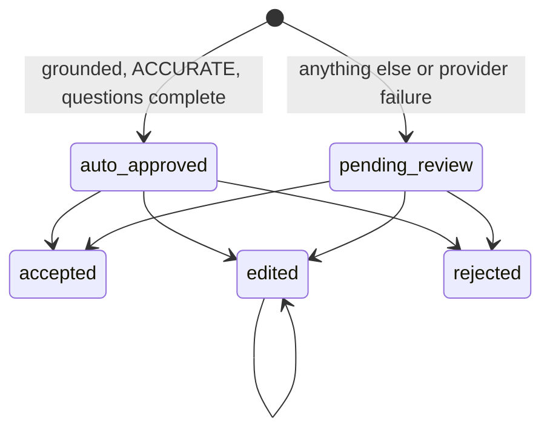
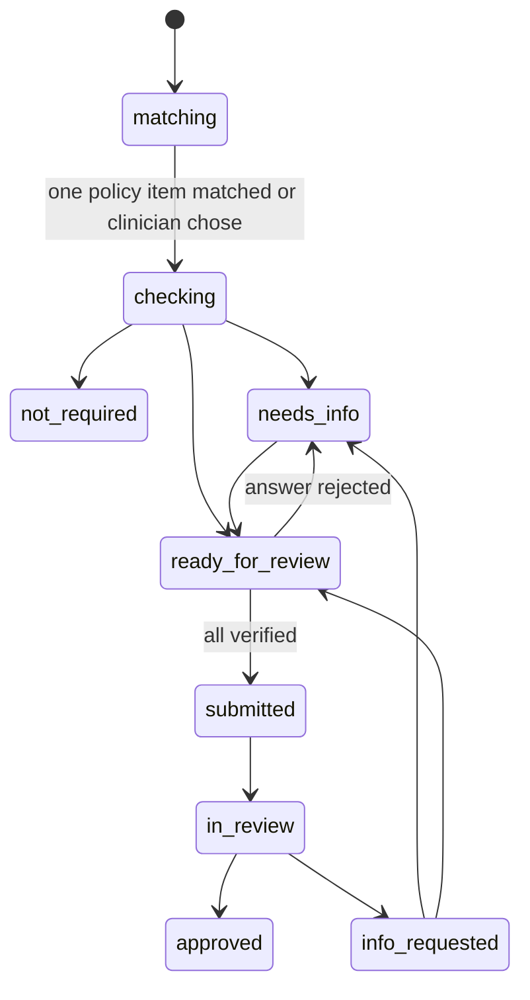

# 03. Data model

## Library tables (this part)

```sql
create table policies (
  id uuid primary key default gen_random_uuid(),
  document_role text not null check (document_role in ('benefit_summary','clinical_policy','drug_criteria')),
  role_hint text,
  role_confirmed_by text,
  source_kind text not null default 'published' check (source_kind in ('published','fictional_fallback')),
  source_url text,
  downloaded_at date,
  file_name text not null,
  storage_path text not null,
  sha256 text not null unique,
  page_count int,
  insurer text, plan_name text, plan_year text,
  identity_evidence jsonb,
  identity_edited_by_human boolean not null default false,
  format_hints jsonb,
  sections jsonb,                          -- tier used, failed tiers and reasons, page ranges
  possibly_truncated boolean not null default false,
  context_report jsonb,                    -- noise removal stats
  working_memory jsonb,                    -- final document memory
  validation_report jsonb,
  fhir_questionnaire jsonb,                -- clinical_policy
  fhir_insurance_plan jsonb,               -- benefit_summary
  ingestion_state jsonb not null default '{}',
  status text not null default 'ingesting' check (status in ('ingesting','paused','draft','live','retired','failed')),
  went_live_by text, went_live_at timestamptz,
  created_at timestamptz default now()
);

create table policy_blocks (               -- drug criteria blocks, indexed without model calls
  id uuid primary key default gen_random_uuid(),
  policy_id uuid not null references policies(id) on delete cascade,
  block_key text not null,
  label text not null,
  start_page int not null, end_page int not null,
  tier_used text not null,
  status text not null default 'indexed' check (status in ('indexed','extracting','draft','live','retired')),
  fhir_questionnaire jsonb,
  went_live_by text, went_live_at timestamptz,
  unique (policy_id, block_key)
);

create table policy_items (
  id uuid primary key default gen_random_uuid(),
  policy_id uuid not null references policies(id) on delete cascade,
  block_id uuid references policy_blocks(id),
  item_type text not null check (item_type in ('coverage','rule')),
  item_key text not null,
  seq int not null,                        -- document order
  service_label text,
  service_codes text[],
  data jsonb not null,                     -- CoverageEntry or Rule (conditions, logic, questions, pass_condition)
  original_data jsonb not null,            -- extractor output, never modified
  page int not null,
  grounding jsonb,
  judge_verdict text check (judge_verdict in ('ACCURATE','WRONG_VALUE','HALLUCINATED','VAGUE','UNAVAILABLE')),
  judge_reason text,
  question_verdict text check (question_verdict in ('complete','missing_condition','added_condition','leading','unavailable')),
  review_state text not null check (review_state in ('auto_approved','pending_review','accepted','edited','rejected')),
  edited_by_human boolean not null default false,
  suggestion jsonb,                        -- newer extractor output for a locked item
  reviewed_by text, reviewed_at timestamptz, review_note text,
  unique (policy_id, item_type, item_key)
);

create table plan_memory (
  id uuid primary key default gen_random_uuid(),
  insurer text not null, plan_name text not null, plan_year text,
  memory jsonb not null,                   -- from live, human-approved items only
  updated_at timestamptz default now(),
  unique (insurer, plan_name, plan_year)
);

create table ingestion_runs (
  id uuid primary key default gen_random_uuid(),
  policy_id uuid references policies(id) on delete cascade,
  plan_key text not null,
  status text not null check (status in ('queued','running','complete','partial','failed')),
  stop_reason text,
  started_at timestamptz, finished_at timestamptz
);
create unique index one_running_per_plan on ingestion_runs (plan_key) where status = 'running';

create table llm_calls (
  id uuid primary key default gen_random_uuid(),
  run_id uuid not null,
  episode_id uuid,                         -- references episodes(id), see 18
  cache_key text,                          -- model-call cache key
  stage text not null, step_no int not null, group_no int, item_key text,
  provider text not null, model text not null, prompt_name text not null,
  status text not null check (status in ('ok','repaired','invalid','timeout','error')),
  latency_ms int, tokens_in int, tokens_out int,
  created_at timestamptz default now()
);
```

## Check tables (this part)

```sql
create table pa_requests (
  id uuid primary key default gen_random_uuid(),
  patient_id uuid not null references patients(id),
  ordering_provider_id uuid not null references providers(id),
  insurer text not null, plan_name text not null, plan_year text,
  order_text text not null, service_code text, drug_name text,
  benefit_summary_id uuid references policies(id),
  coverage_item_id uuid references policy_items(id),
  criteria_policy_id uuid references policies(id),
  criteria_block_id uuid references policy_blocks(id),
  match_candidates jsonb,
  status text not null check (status in (
    'matching','checking','not_required','needs_info','ready_for_review',
    'submitted','in_review','info_requested','approved')),
  coverage_note text,
  readiness numeric not null default 0 check (readiness between 0 and 1),
  submission_packet jsonb, packet_version int not null default 0, submitted_at timestamptz,
  created_at timestamptz default now(), updated_at timestamptz default now()
);

create table pa_criteria (
  id uuid primary key default gen_random_uuid(),
  pa_request_id uuid not null references pa_requests(id) on delete cascade,
  policy_item_id uuid references policy_items(id),
  seq int not null,
  criterion_key text not null,
  requirement_text text not null,
  criterion_type text not null check (criterion_type in (
    'diagnosis','lab','prior_treatment','duration','clinical_note','exclusion','age','prescriber')),
  policy_page int not null,
  origin text not null default 'policy' check (origin in ('policy','insurer_request')),
  pass_condition jsonb not null,
  status text not null check (status in ('met','missing','unclear')),
  status_reason text,
  evidence_text text,
  likely_owner_provider_id uuid references providers(id), likely_owner_reason text,
  verified_by uuid references providers(id), verified_at timestamptz,
  unique (pa_request_id, criterion_key)
);

create table pa_answers (
  id uuid primary key default gen_random_uuid(),
  pa_criterion_id uuid not null references pa_criteria(id) on delete cascade,
  link_id text not null, seq int not null,
  question_text text not null,
  answer_type text not null check (answer_type in ('boolean','quantity','date','string','coding')),
  enabled boolean not null default true,
  value jsonb, unit text,
  fill_method text check (fill_method in ('code_lookup','date_math','llm_quote','llm_quote_value','clinician_entered')),
  evidence_text text,
  evidence_record_id uuid references clinical_records(id),
  review_state text not null default 'unanswered' check (review_state in (
    'ai_filled','unanswered','clinician_confirmed','clinician_rejected','clinician_entered')),
  edited_by_human boolean not null default false,
  rejected_ai_value jsonb, reject_reason text, attestation text,
  answered_by uuid references providers(id), answered_at timestamptz,
  unique (pa_criterion_id, link_id),
  check (fill_method <> 'clinician_entered' or (attestation is not null and length(attestation) >= 10)),
  check (review_state <> 'clinician_rejected' or reject_reason is not null)
);

create table pa_events (
  id uuid primary key default gen_random_uuid(),
  pa_request_id uuid not null references pa_requests(id) on delete cascade,
  event_type text not null check (event_type in (
    'created','matched','not_required','checked','rechecked','answer_rejected','answer_entered',
    'verified','submitted','in_review','info_requested','criteria_added','approved')),
  message text,
  actor text not null check (actor in ('engine','clinician','insurer')),
  created_at timestamptz default now()
);

-- Answer caching is the 'answer' layer of artifact_cache (18).
-- episodes and artifact_cache are defined in 18-EPISODIC-MEMORY-AND-CACHE.md.
-- review_log and pa_events each add: episode_id uuid references episodes(id).

create table review_log (
  id uuid primary key default gen_random_uuid(),
  actor text not null,
  actor_role text not null check (actor_role in ('policy_reviewer','clinician','content_reviewer')),
  target_table text not null, target_id uuid not null,
  action text not null check (action in (
    'confirm_role','identity_edit','accept','edit','reject','apply_suggestion','go_live','retire',
    'answer_reject','answer_enter','verify','submit','approve_synthetic')),
  before jsonb, after jsonb, note text,
  created_at timestamptz default now()
);
```

`review_log` is append-only (no update or delete grants). Realtime on `policy_items`, `pa_requests`, `pa_criteria`, `pa_answers`, `pa_events`.

## Contract tables (Sambhav owns, this part reads and inserts facts)

```sql
-- Patient chart stored FHIR-native: one row per FHIR resource plus flattened fields for matching
create table clinical_records (
  id uuid primary key default gen_random_uuid(),
  patient_id uuid not null references patients(id),
  resource_type text not null check (resource_type in (
    'Condition','MedicationRequest','MedicationStatement','Observation','Procedure',
    'ServiceRequest','DocumentReference','Encounter')),
  record_kind text not null check (record_kind in ('diagnosis','medication','lab','procedure','referral','note','encounter')),
  code text, code_system text, display text,
  value text, unit text,
  start_date date, end_date date,
  body text,                               -- original full text for notes; quotes verify against this
  author_provider_id uuid references providers(id),
  source_document_id uuid references documents(id),
  fhir_resource jsonb,                     -- the full FHIR R4 resource
  synthetic boolean not null default true,
  created_at timestamptz default now()
);
```

`patients` must carry `synthetic boolean not null default true` and a date of birth. `providers` carries specialty (used by `prescriber` rules).

## State machines

Policy item review:



`auto_approved` is routing, not approval. Policies and drug blocks go live only when every item is accepted, edited, or rejected.

PA request:



Illegal transitions return `INVALID_TRANSITION`.

## Human lock (H1)

```
repository.write(row, change, actor):
    if row.edited_by_human and actor is engine: keep row, store change as suggestion, log LOCK_PRESERVED
```

Applies to `policy_items`, policy identity, question text, and `pa_answers`. Verified rules are skipped by re-check.

## Shapes

```python
class CoverageEntry(BaseModel):
    service_label: str; service_codes: list[str]; pa_required: bool
    page: int; evidence_text: str; marker_used: str | None; reference: str | None

class Condition(BaseModel):
    condition_key: str; text: str
    kind: Literal["requirement","exception","alternative"]
    value: float | None = None; unit: str | None = None

class Question(BaseModel):
    link_id: str; text: str
    answer_type: Literal["boolean","quantity","date","string","coding"]
    unit: str | None = None
    fill_method: Literal["code_lookup","date_math","llm_quote","llm_quote_value"]
    covers: list[str]; enable_when: dict | None = None
    text_edited_by_human: bool = False

class Rule(BaseModel):
    criterion_key: str; requirement_text: str
    criterion_type: Literal["diagnosis","lab","prior_treatment","duration","clinical_note","exclusion","age","prescriber"]
    subtype: Literal["medication","therapy"] | None = None
    logic: Literal["all_of","any_of"] = "all_of"
    policy_page: int; applies_to: list[str]; codes: list[str] = []
    conditions: list[Condition]
    questions: list[Question] = []; pass_condition: dict | None = None
```
