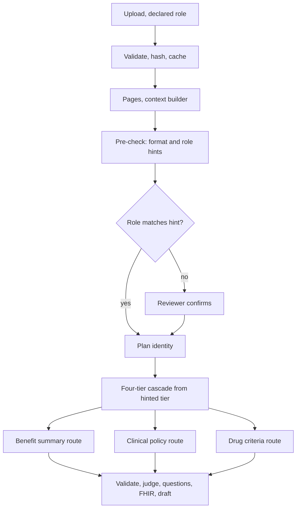

# 05. Ingestion: pre-check, four-tier cascade, and three document routes

Every real document enters through the same front door, then splits by role. Stage order and memory are governed by `06`.



## Stages

| # | Stage | Model calls |
|---|---|---|
| 1 | Validate: PDF magic bytes, size, text layer (`NO_TEXT_LAYER` otherwise) | 0 |
| 2 | Fingerprint cache: sha256 checked globally first; hit returns stored policy; otherwise resume from the last completed episode and reuse finalized stage artifacts (`18`) | 0 |
| 3 | Pages: pdfplumber text per page; printed page labels; offset trusted only when the same offset is seen on 2+ pages | 0 |
| 4 | Context builder cleaning (`06`) | 0 |
| 5 | Pre-check: format and role hints | 0 |
| 6 | Plan identity (P-ID) on first 5 clean pages; evidence verified; never from file name | 1 |
| 7 | Load plan memory for this insurer, plan, year | 0 |
| 8 | Four-tier cascade and role route | 0 |
| 9 | Extraction by role, sequential page groups with working memory | 1 per group |
| 10 | Schema, dedup, grounding | 0 |
| 11 | Judge (P2), bounded concurrency, re-sorted | 1 per item |
| 12 | Question build (code), phrasing (P5), question checks (code), question judge (P6) | 2 per rule |
| 13 | Review routing (`11`) | 0 |
| 14 | FHIR build and validation (`09`), markdown audit, save draft | 0 |

## Pre-check (hints, never answers)

| Hint | How | Used for |
|---|---|---|
| TOC present | In first 10 pages, 5+ lines shaped "title ... number", dot leaders optional | Start at Tier A |
| Header styling | Larger or bold character runs from pdfplumber | Start at Tier B |
| Table density | Tables per page | Start at Tier C |
| Length | Pages | Short clinical policies skip locating |
| Role signature | Generic genre phrases scored per role | Compare with declared role |

| Role | Generic signature phrases (never insurer names) |
|---|---|
| benefit_summary | evidence of coverage, summary of benefits, benefits chart, what you pay, cost sharing, copayment, coinsurance, in-network |
| clinical_policy | medical policy, clinical policy, coverage policy, medically necessary, coverage criteria, indications, policy number, effective date |
| drug_criteria | prior authorization criteria, drug name, covered uses, exclusion criteria, required medical information, age restrictions, prescriber restrictions, coverage duration |

A clear mismatch pauses ingestion (`status = paused`) until the reviewer confirms the type.

## Four-tier cascade

Start at the hinted tier; on failure, try the remaining tiers in order A, B, C, D. First tier that passes its check wins. Failed tiers and reasons are recorded.

| Tier | Method | Success check | Cap |
|---|---|---|---|
| A. Table of contents | Multiline regex: optional section word and number, title, optional dot leaders, page number. Digits count as a section number only next to a section word, so years are not chapters. End = next entry start minus one. | Target section found; ranges ascending and inside the document; first page contains the title or target terms | None; bounded by last page |
| B. Header scan | Styled, all-caps, or numbered headings ("4.2") matched to role target titles | Target header followed by target terms within 2 pages | `SECTION_PAGE_CAP` |
| C. Table structure | Tables with role columns (service plus cost or authorization) or authorization markers | 2+ consecutive qualifying pages | `SECTION_PAGE_CAP` |
| D. BM25 | rank_bm25 over clean pages with generic role terms plus order terms at order time | Pages above relative threshold, merged into runs | `SECTION_PAGE_CAP` |

B, C, D hitting the cap set `possibly_truncated` on the policy and its items.

## Route 1: Benefit summary or EOC

| Aspect | Rule |
|---|---|
| Targets | Benefits chart; section defining authorization and markers; definitions; drug chapter only for marker meaning |
| Usual tier | A, else C |
| Cleaning | Tables linearized `Service: ... | You pay: ... | Authorization: ...`; markers kept |
| Unit | Chart page groups, strictly sequential |
| Prompt | P0: coverage entries |
| Grounding | Evidence text on page; if PA relies on a marker, the marker definition is in memory with its own verified page |
| Output | `coverage` items; FHIR `InsurancePlan` |
| Memory | Markers, section path, services found |

## Route 2: Clinical policy

| Aspect | Rule |
|---|---|
| Targets | Coverage or medical necessity criteria; definitions; limitations or exclusions; coding section (feeds `applies_to`); header metadata |
| Skipped | Background, rationale, evidence summaries, references, revision history |
| Usual tier | Short documents: header scan only to drop skipped sections; longer: B then A |
| Cleaning | List numbering and indentation kept, so "all of" and "one of" survive |
| Unit | Whole criteria section in one call when within budget, else sequential groups with `open_item` |
| Prompt | P1: rules with conditions, logic, exceptions, `applies_to` |
| Grounding | Numbers, codes, exception words on the cited page |
| Output | `rule` items; FHIR `Questionnaire` |
| Memory | Definitions, open item, logic group |

## Route 3: Drug criteria

| Aspect | Rule |
|---|---|
| Targets | One block per drug or group, marked by repeated field labels |
| Locating | A: drug index; B: repeated field-label block starts; C: table-form criteria; D: a specific drug at order time |
| Index first | All blocks indexed in code with no model calls |
| Extract on demand | When the reviewer activates a block or a clinician first orders the drug; block must pass Gates 1 and 2 before use |
| Cleaning | One block per call; field labels kept |
| Unit | One block; blocks are independent, so bounded concurrency, re-sorted by page |
| Prompt | P1-D: fields to rules; exclusion, age, prescriber types; coverage duration as metadata |
| Grounding | Drug name and field labels in the block; numbers on the cited page |
| Output | `rule` items per `block_id`; FHIR `Questionnaire` per block |

## Mixed documents

An EOC drug chapter is used only for marker meaning. A clinical policy covering several services yields rules separated by `applies_to`. A document fitting no role pauses for the reviewer.

## Grounding

```
ground(item, pages_sent):
  fail if item.page not in target pages (context-only pages are not citable)
  page = normalize(pages_sent[item.page])
  coverage: evidence_text in page; pa_required relies on marker -> marker definition verified in memory
  rule: every code in page; every condition value in page (forms: "6", "6.0", "six", "six (6)");
        every exception condition -> an exception word on page
  drug: block label and field label present in block
```

Grounding failure routes the item to `pending_review` with the reason; it is never silently dropped.

## Dedup

Same normalized service label or criterion key: keep the version with more conditions and earlier page; record the merge in the validation report.

## Reprocess

`POST /policies/{id}/reprocess` reruns stages 3 to 14. Locked items keep their values; new extractor output is stored as `suggestion` for a human to apply or dismiss.
