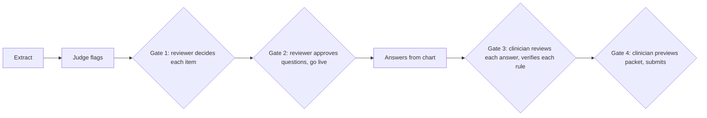

# 11. Human in the loop

**LLM extracts. An independent LLM judges. A human decides.**

## Gates

| Gate | Who | Sees | Can | Cannot |
|---|---|---|---|---|
| 0. Document type | Reviewer | Declared role vs pre-check hint | Confirm type | Skip when they differ |
| 1. Items | Policy reviewer | Item, source page text, grounding, judge verdict and reason, original vs current | Accept; edit; reject with note; correct identity; apply or dismiss suggestions | Accept a grounding failure without editing or noting |
| 2. Questions, go-live | Policy reviewer | Questions, types, enableWhen, pass condition, question verdict, coverage, FHIR validity | Edit wording (numbers re-checked); go live | Edit pass conditions directly |
| 3. Answers | Ordering clinician | Every answer with quote, source, method, badge | Confirm via verify; reject with reason; enter with source and attestation; upload; start huddle | Mark met without a satisfying answer |
| 4. Packet | Ordering clinician | Full packet | Submit or go back | Submit with any rule unverified |
| S. Synthetic content | Content reviewer (Sambhav or Suman) | Generated notes and PDFs | Approve or regenerate | Seed unreviewed content (`15`) |

## Routing (judge flags, never approves)

| Condition | Routed to | Queue order |
|---|---|---|
| Grounded, ACCURATE, questions complete | auto_approved (still needs a human decision) | 6 |
| HALLUCINATED | pending_review | 1 |
| WRONG_VALUE | pending_review | 2 |
| Grounding failed or grounded only in memory | pending_review | 3 |
| Question verdict not complete | pending_review | 4 |
| VAGUE or UNAVAILABLE | pending_review | 5 |

## Locks (H1)

| Object | Locked when | Effect |
|---|---|---|
| Policy item | Reviewer edits | Reprocess stores new output as suggestion only |
| Identity | Reviewer corrects | Never overwritten |
| Question text | Reviewer edits | Kept on rebuild; numbers still validated |
| Answer | Clinician rejects or enters | Re-check never changes it |
| Verified rule | Clinician verifies | Re-check skips it |

Test: a locked item survives a forced reprocess that supplies different values while an unlocked sibling updates.

## Audit

Every human action writes `review_log` (actor, role, target, action, before, after, note, time). The policy audit export and the packet include the decisions. Drug blocks pass Gates 1 and 2 per block; an unreviewed block is never used.

## Demo moments

1. Upload a real clinical policy; queue shows a WRONG_VALUE item; edit it; lock appears.
2. Go live; download the audit and the FHIR Questionnaire.
3. On the checklist, reject one AI answer with a reason; readiness drops; upload the right report; readiness returns.
4. Preview the packet: verifier names, attestations, cited pages.
