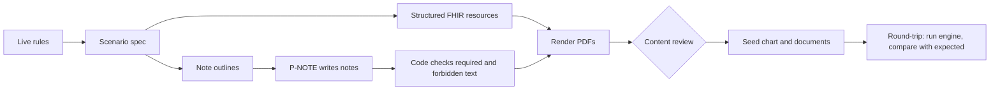

# 15. Synthetic patients generated from real rules

Patients are never real. Their reports are generated **from the live rules** so each demo scenario (and each eval variant) has a known correct answer. This follows the earlier work's synthetic generator with answer keys, applied to patient reports.

## Ownership

| Part | Owner |
|---|---|
| Scenario spec from live rules, round-trip check, eval variants | Suman |
| Running the generator, seeding `patients`, `providers`, `care_team`, `clinical_records`, `documents`; content review | Sambhav |
| Huddle evidence document for the demo (the missing report) | Harry uses the generated file |

## Pipeline



## 1. Scenario spec (generated from live rules, edited by a human)

```json
{
  "scenario_id": "maria_mri_start",
  "seed": 42,
  "demo_today": "2026-09-27",
  "patient": { "name": "Maria Rodriguez", "dob": "1974-03-11", "sex": "female", "member_id": "SYN-0042" },
  "plan": { "insurer": "Example Health Plan", "plan_name": "Example PPO", "plan_year": "2026" },
  "providers": [
    { "key": "reyes", "name": "Dr. Ana Reyes", "specialty": "spine" },
    { "key": "patel", "name": "Dr. Raj Patel", "specialty": "primary care" }
  ],
  "order": { "order_text": "MRI lumbar spine without contrast", "service_code": "72148", "ordered_by": "reyes" },
  "criteria": [
    { "criterion_key": "lbp_radicular_dx", "outcome": "met", "holder": "reyes",
      "facts": [ { "kind": "diagnosis", "code": "<code from the live rule>", "start": "-12w" } ] },
    { "criterion_key": "neuro_symptom", "outcome": "met", "holder": "reyes",
      "required_sentence": "Patient reports numbness in the left foot since August." },
    { "criterion_key": "pt_six_weeks", "outcome": "missing", "holder": "patel",
      "facts": [ { "kind": "referral", "display": "Physical therapy referral", "date": "-10w" } ],
      "withheld_document": { "type": "pt_progress_note", "required_sentence": "Completed 7 weeks of physical therapy.", "last_session": "-1w" } }
  ]
}
```

Rules:
- Every `criterion_key` must exist in the live policy; codes and thresholds come from the rule, not from memory.
- Dates are relative to `demo_today` so date math is reproducible.
- `outcome` per criterion is the answer key.
- A withheld document is generated but not seeded; it is the file uploaded live in the demo.

## 2. Structured resources (code)

Build FHIR R4 resources: Patient, Practitioner, Condition, MedicationRequest, Observation, Procedure, ServiceRequest (referrals), Encounter. Optionally start from a Synthea patient for realistic background history (demographics, unrelated conditions), then inject the scenario resources. Background resources must not accidentally satisfy or contradict any criterion; the round-trip check catches this.

## 3. Notes (P-NOTE, then code checks)

Each note has an outline: author, date, visit reason, required sentences (verbatim), allowed facts, forbidden topics (anything that would satisfy a criterion marked missing). Code verifies every required sentence appears exactly and no forbidden topic appears. Failures regenerate with a new attempt (max 3), else the outline is fixed by a human.

## 4. Render PDFs

reportlab, one PDF per encounter or report: fictional clinic header, author, date, body, and a footer on every page: "SYNTHETIC TEST DATA. NOT A REAL PATIENT." Also export the FHIR bundle JSON.

## 5. Content review (Gate S)

A human reads every generated note and PDF before seeding (clinically plausible, nothing offensive, nothing real). Approval is logged in `review_log` (`approve_synthetic`).

## 6. Seed

`patients.synthetic = true`; `clinical_records` from the bundle (with `fhir_resource`) and from notes (`DocumentReference`, original `body`); `documents` rows for PDFs.

## 7. Round-trip check (the answer key test)

Run the real engine on the seeded patient for the scenario's order. Each criterion's status must equal its `outcome`. Then upload the withheld document and re-check: the missing criterion must become met. Any mismatch means the generator or the engine is wrong; investigate before the demo. Results go to `eval/gold_patients/`.

## 8. Variants for evaluation

The generator flips one criterion at a time (satisfied, missing, below threshold, outside window, exception, paraphrase-only, conflicting) to produce the patient variants in `13`, each with its answer key.

## Rules

- No real people, real addresses, real member IDs, or real provider names. Obviously fictional clinic names.
- Every page labeled synthetic; `synthetic = true` on every row.
- Generator runs are seeded and reproducible.
- Generated content never flows back into rule extraction.
